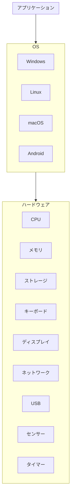
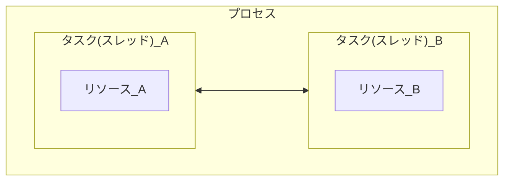
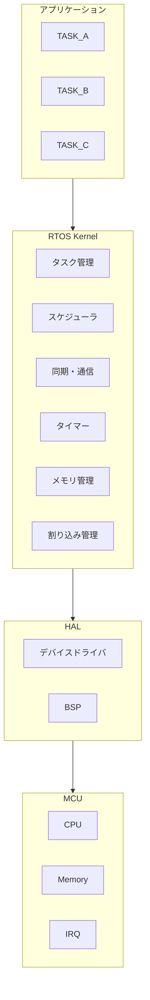

# 0.RTOSの概要

## 0.0 理解するポイント

組み込みシステムにRTOSを使用する理由と、複数のタスクを管理しながら、要求された時間内に処理を実行する仕組みを理解する。

## 0.1 OSとは

### OS（Operating System）
ハードウェアとアプリケーションの間でコンピュータ資源を管理する基本ソフトウェア
アプリケーションがハードウェアを利用するためのI/Fとなるもの

### 構造 

### 役割
  - CPU管理：どのCPUにどの処理を実行させるかを管理する　#要学習
  - メモリ管理：どのプログラムがどのくらいメモリを使用しているか管理する #要学習
  - デバイス管理：キーボード、ディスプレイ、ストレージなどのデバイスを扱う #要学習
  - プログラムの実行管理：複数のプログラムを実行、終了させる

### 利点：ハードウェアとアプリケーションの関係
  - 直接操作の問題点：アプリケーションがハードウェアを直接操作すると、競合や不整合、セキュリティ問題、複雑な機種依存コードが増えてしまう。
  - OSの仲介：アプリケーションはOSのAPI(関数)を呼ぶだけで、OSが適切にハードを操作してくれるため、移植性、安全性が向上する。
  
### CPU・メモリ・I/Oなどのリソース管理
  - CPU管理(スケジューリング)：どのプログラムにCPUをいつ割り当てるかを決める。複数のプログラムを同時に動かす「見せかけの並列」を実現する。
  - メモリ管理：各プログラムに必要なメモリを割り当て、他のプログラムから保護する。仮想メモリやページングは大規模OSの機能だが、RTOSでも領域管理は重要な機能として求められる。
  - I/O管理：ディスク、ネットワーク、シリアル、USBなどの入出力を制御し、デバイスドライバを通じてアプリに抽象化された操作を提供する。
### プログラムの実行管理
  - プロセス（プロセス＝実行中のプログラム）：実行に必要なメモリ空間やリソースを持つ単位。

  - スレッド（タスク）：プロセス内で並行して動く実行の流れ。軽量で複数のスレッドが同一プロセスの資源を共有する。

  - 状態遷移：実行中（Running）、実行可能（Ready）、待ち（Blocked）、終了（Terminated）などの状態をOSが管理する。

  - コンテキスト切替：CPUを別のプロセス／スレッドに渡すとき、レジスタやプログラムカウンタなどの状態を保存・復元する操作。
    - 切り替えの決定：スケジューラが次に実行すべきタスクを選ぶ（割り込み、タイマ、システムコール、タスクの待ち解除などがトリガ）。

    - 現在のコンテキスト保存：現在のCPUレジスタ、プログラムカウンタ、スタックポインタ、プロセッサ状態フラグなどをタスク管理ブロック（TCB）やカーネルスタックに保存する。

    - カーネルデータ更新：現在タスクの状態を「実行可能」「待ち」などに更新し、次タスクの状態を「実行中」に設定する。

    - アドレス空間切替（必要時）：プロセス間切替ならページテーブルやMMUの設定を切り替える。RTOSで同一アドレス空間なら不要。

    - 追加リソース切替：FPUレジスタ、浮動小数点状態、ベクトルユニット、割り込みマスクなどを保存／復元する（必要な場合のみ）。

    - 次タスクのコンテキスト復元：次タスクの保存済みレジスタやスタックポインタ、プログラムカウンタをCPUに復元し、実行を再開する。
### プロセスとタスクの基本概念
  - プロセス：プログラムの実行単位。独立したメモリ空間を持つ。

  - タスク（スレッド）：より軽い実行単位。組み込み分野では「タスク」という呼び方が一般的で、RTOSではタスクがスケジューラで管理される。

※タスクは同じプロセスのリソース（ファイルやメモリ）を共有するが、別プロセスは共有しない。

### スケジューリングの基本
- 目的：複数の実行単位（プロセス／タスク）に対してCPUを効率的かつ公平に割り当てる。

- 代表的な方式（概念）

  - ラウンドロビン方式：順番に一定時間ずつ回す。公平だがリアルタイム性は弱い。

  - 優先度方式：重要度の高いタスクを優先して実行する。リアルタイム用途で多用される。

  - 最短処理時間優先方式 / EDF：処理時間や期限に基づく動的な割当て。理論的に効率が良いが実装が複雑。

  - プリエンプション：高優先度タスクが来たら低優先度タスクを中断してCPUを渡す仕組み。これにより応答性が向上するが、設計と解析が必要。

### 身近なOSの例- Windows
- Windows：デスクトップ向け。GUI・互換性・豊富な機能を重視。

- Linux：サーバーから組み込みまで幅広く使われる。オープンソースでカスタマイズ性が高い。

- macOS：AppleのデスクトップOS。Unix系の設計をベースにGUIやアプリエコシステムを統合。

- iOS：AppleのモバイルOS。厳格なコード署名と配布(App Store)、レイヤードアーキテクチャで構成。

- Android：モバイルOS。Linuxカーネル上にアプリフレームワークを載せた形で、スマホ向けに最適化されている。

### OSを使用しない場合の問題
- 直接ハード操作の複雑さ：各アプリがハードを直接操作すると、デバイスごとにコードを書き分ける必要があり、移植性が著しく低下する。

- 資源競合の管理が難しい：複数のプログラムが同時にメモリやI/Oを使うと衝突やデータ破壊が起きやすい。

- 安全性と安定性の低下：一つのプログラムのバグでシステム全体が停止するリスクが高まる。

- 並行処理の実装負荷：スレッド管理、同期、デッドロック回避などを各アプリが自前で実装する必要があり、開発コストとバグの増加を招く。

- 効率的な資源利用が困難：CPUやメモリを公平かつ効率的に分配する仕組みがないため、性能が低下しやすい。

例：組み込み機器でOSが無いと、割り込み処理やタイミング制御をすべて手作業で管理する必要があり、設計ミスで致命的な遅延や誤動作が発生しやすい。
## 0.2 RTOSとは

### RTOS（Real-Time Operating System）
時間的な制約を持つリアルタイム性が重視される処理を適切に実行することを重視したOS
実行速度重視というより、要求された時間内での処理実行を目的として設計され、タスク実行順序や応答時間(レイテンシ)を厳密に管理する。

### 役割
- CPU管理
- メモリ管理
- プログラム実行管理
- タスク管理
- I/O管理
- タスク間の同期・通信

### RTOSが必要とされる背景
- 時間制約の厳格化：センサ入力→制御出力などの遅延が許されない用途が増えたため。
- 並列処理の増加：複数の機能（通信、制御、監視など）を同時に安定して動かす必要がある。
- 安全性・信頼性の要求：故障や遅延が重大な結果を招く分野（自動車のブレーキ制御など）で必須とされる。
- ハードウェアの進化：マルチコアや高性能MCUの普及で、効率的なタスク管理が求められる。

### 一般的なOSとRTOSの違い
|属性|一般的なOS(Windows,Linux)|RTOS|
|---|---|---|
|目的|ユーザ利便性・多機能性|時間制約の保証|
|スケジューリング重視点|スループット・公平性|応答時間・デッドライン遵守|
|割り込み応答|比較的遅延あり得る|低遅延で確定的|
|プリエンプション|実装により非リアルタイム|高度に制御されたプリエンプション|
|リソース管理|柔軟で複雑|軽量で決定論的（予測可能）|
|使用例|デスクトップ,サーバ|組み込み制御,リアルタイム制御|

### RTOSが重視するもの
- 決定論的な応答（Determinism）：同じ入力に対して常に予測可能な応答時間を提供すること。

- 低遅延：割り込みから処理開始までの遅延を最小化。

- 優先度制御：重要タスクを確実に実行するための優先度方式のスケジューリング。

- タスク同期と排他制御：デッドロックや優先度逆転を防ぐ仕組み（優先度継承など）。

- 小さなメモリフットプリント：組み込み機器向けに軽量であること。
### RTOSと組み込みシステムの関係
- 関係：組み込みシステムはハードウェア制約（メモリ、CPU、電力）とリアルタイム要件を持つことが多く、RTOSはこれらに最適化されたOSとして使われる。

- 役割分担：ハードウェア制御やデバイスドライバは低レイヤで、RTOSはタスク管理・通信・タイマ・割り込み管理などを提供してアプリケーションを安定稼働させる。
### RTOSの代表例
- μITRON系
  - 概要：日本発祥の組み込み向けリアルタイムOS仕様。組み込み機器向けに広く採用されている。
  - 特徴：仕様が軽量で組み込み向けに最適化されている。商用実装やオープン実装が存在する。
  - 用途：家電、自動車、産業機器など、日本の組み込み分野で歴史的に強い。
- FreeRTOS
  - 概要：オープンソースの小型RTOSで、組み込みマイコン向けに広く使われている。
  - 特徴：軽量、移植性が高い。APIがシンプル。商用サポートや拡張(Amazon FreeRTOSなど)あり。
  - IoTデバイス、センサノード、マイコンベースの製品など。
### その他のRTOS
- VxWorks：Wind River製、航空宇宙や産業用途での実績がある商用RTOS。

- QNX：BlackBerry（旧QNX）製、車載や産業用途での高信頼性RTOS。

- ThreadX：Express Logic（現Microsoft）製、組み込み向けで高速・軽量。

- Zephyr：Linux Foundation主導のオープンソースRTOS、IoT向けに注目。

- RTEMS：オープンソースで宇宙・ミッションクリティカル用途にも使われる。

### RTOSを使用するメリット
- 確定的な応答時間により安全性・信頼性が向上する。

- タスク分離と優先度管理で複雑な並列処理を整理できる。

- 割り込み処理の効率化によりセンサ応答や制御ループが安定する。

- 開発の効率化：スケジューラや同期プリミティブが提供されるため、アプリ側は制御ロジックに集中できる。

- スケーラビリティ：機能追加やマルチコア化に対応しやすい。

- 保守性・検証性：時間的振る舞いが予測可能なためテストや認証が行いやすい（安全規格対応など）。

### RTOSを使用することで何が管理しやすくなるか
- タスク（スレッド）：優先度、状態（実行・待ち・停止）を管理。

- スケジューリング：優先度ベース、ラウンドロビン、デッドラインベースなどの方式でCPU割当を管理。

- 割り込みハンドラ：割り込み優先度と割り込みからのタスク起床を管理。

- タイマと周期処理：周期タスクやタイムアウト処理を正確に管理。

- 同期機構：ミューテックス、セマフォ、イベントフラグ、メッセージキューなどでタスク間同期と通信を管理。

- メモリ管理：静的割当や決定論的な動的割当（必要に応じて）を管理。

- デバイスドライバ：デバイスアクセスの調停やI/Oの制御。

- 電源管理：スリープ／ウェイク制御や低消費電力モードの管理（RTOSがサポートする場合）。

- 診断・ログ：実行トレースや統計情報で動作確認やデバッグを支援。
## 0.3 リアルタイム性

### リアルタイム性とは
システムが外部の時間制約（イベント発生やデッドライン）に対して決められた時間内に応答・処理を完了する性質。
単に「速い」ことではなく、応答の時間的保証（期限遵守）が本質。
- ハードリアルタイム
  - 定義：デッドライン違反が許されないシステムカテゴリ。期限を超えると安全性や正当性が損なわれる。

  - 特徴：厳密な解析（WCET/WCRT）、決定性の高い実装、優先度ベースや静的スケジューリングの採用、冗長化やフェイルセーフ設計。

  - 例：航空機のフライトコントロール、原子力制御、医療用ペースメーカー（安全クリティカル）。

- ソフトリアルタイム
  - 定義：デッドライン違反が発生してもシステムは継続するが、性能や品質が低下するカテゴリ。

  - 特徴：平均応答や遅延分布が重視される。遅延は許容されるが頻発するとユーザ体験や品質に影響。

  - 例：音声・映像ストリーミング、オンラインゲーム、一般的なマルチメディア処理。

### 時間制約（Deadline）
- 定義：ある処理や応答が完了すべき絶対的または相対的な時刻。

- 種類
  - ハードデッドライン：期限を超えるとシステムや環境に致命的な影響（安全性の喪失など）が生じる。

  - ソフトデッドライン：期限を超えても機能は継続するが性能や品質が低下する（遅延許容）。
### 応答時間（Response Time）
- 定義：外部イベント（入力、割り込み、要求）を受けてからシステムが最初の有効な応答を返すまでの時間。

- 最悪ケース応答時間（Worst‑Case Response Time： WCRT）：応答時間評価で重要な指標。リアルタイム性の保証はこの最悪ケースがデッドライン内に収まるかで判断される。
### 処理時間
- 定義：特定のタスクや処理がCPUなどで実際に動作している時間（純粋な計算時間）。

- 最悪ケース実行時間（Worst-Case Execution Time：WCET）：リアルタイム設計で重要な指標。スケジューリングや応答時間解析の基礎となる。
### 決定性（Determinism）
- 定義：同じ入力・条件に対して予測可能で一貫した時間的振る舞いを示す性質。

- 意味合い：決定性が高いほどWCETやWCRTの見積もりが信頼でき、デッドライン保証がしやすい。非決定的要素（キャッシュ、分岐予測、ガベージコレクションなど）は解析を難しくする。
### 「速い」と「リアルタイム」の違い
|属性|速い|リアルタイム|
|---|---|---|
|主眼|平均的・典型的な処理速度|時間保障(期限遵守)|
|評価基準|平均応答時間・スループット|最悪ケース応答時間とデッドライン遵守|
|失敗の意味|単に遅い|デッドライン違反で機能不全や安全問題に発展する可能性|

### リアルタイム性とスケジューリングの関係
- 目的：スケジューリングはタスクの実行順序と割り当てを決め、デッドライン遵守を達成するための手段。

- 代表的アルゴリズム：

  - 固定優先度スケジューリング（Rate Monotonic Scheduling：RMS）：周期タスクに対する静的優先度付け。理論的な利用率限界がある。

  - 動的優先度スケジューリング（Earliest Deadline First：EDF）：最も早いデッドラインを持つタスクに優先度を与える。理論上は高いCPU利用率までデッドラインを満たせる。

- 解析手法：WCETの見積もり、応答時間解析（RTA）、利用率テスト、シミュレーションなどにより「すべてのタスクがデッドライン内に収まるか」を検証する。

- 実装上の配慮：割り込み遅延、コンテキストスイッチコスト、共有資源の排他制御（優先度逆転対策）、キャッシュ効果、OSの決定性（リアルタイムOSの採用）などを考慮する必要がある。
## 0.4 組み込みシステムにおけるRTOSの役割

## 0.5 RTOSの基本構成

### Application
### RTOS Kernel
### Scheduler
### Device Driver
### BSP
### HAL
### CPU
### RAM / ROM
### Interrupt Controller
### Timer
### RTOS API
### SVC / System Call
## 0.6 RTOSが提供する基本機能
## 0.7 タスク設計と実行順序
## 0.8 割り込み処理とハンドラ設計
## 0.9 性能評価と検証
## 0.10 実装例と開発上のベストプラクティス

