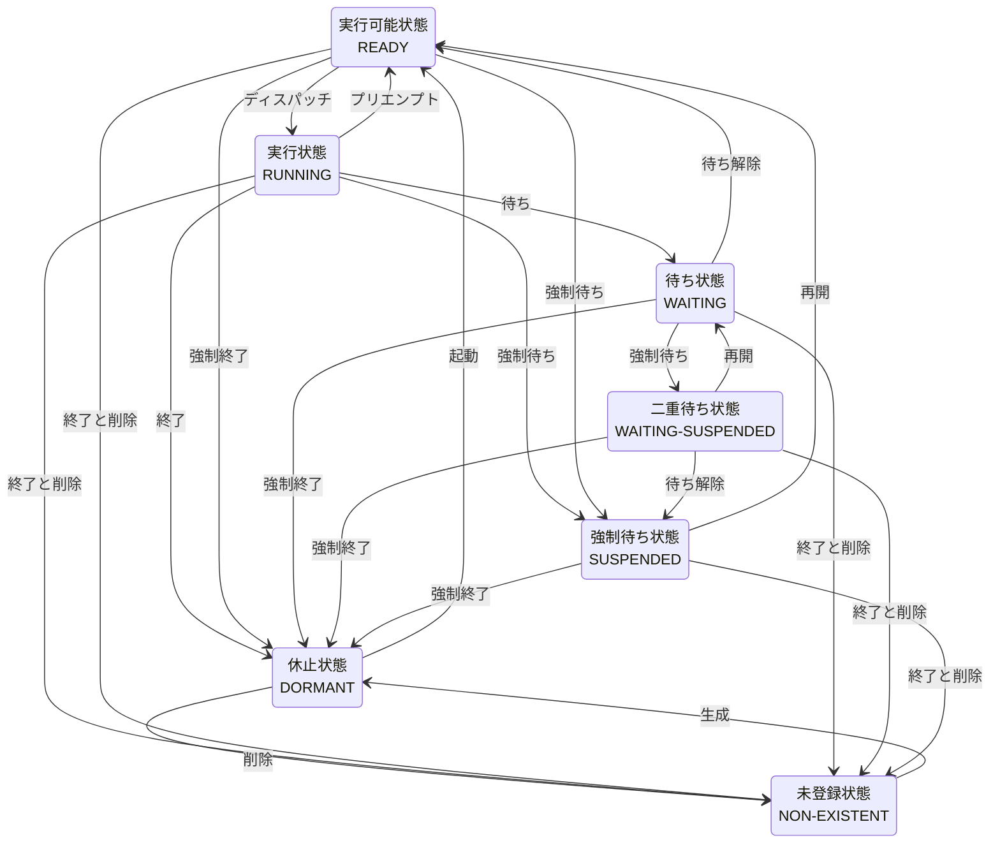

# 1. タスク管理機能
参照元：μITRON4.0仕様

## 1.0 理解するポイント
### 基礎内容
- タスクのライフサイクル：生成（cre_tsk）、起動（act_tsk）、終了（ext_tsk）、待ち（wai_tsk）などの状態遷移。

- タスク属性：優先度、タスク属性（周期タスク/非周期タスク、オートスタートなど）、スタックサイズの決め方。

- スケジューリング方式：優先度ベースのプリエンプティブスケジューリングの基本と同優先度タスクの扱い（ラウンドロビン等）。

- コンテキスト切替のコスト：頻繁な切替が性能に与える影響と最適化の考え方。

- APIのエラー処理：戻り値（E_OK, E_ID, E_NOID, E_OBJ 等）と呼び出し制約。
## 1.1 タスク・状態遷移

### タスクの基本概念
- タスク：RTOSが管理する並行して実行されるプログラム(実行)単位。タスクIDで識別される。
- タスク管理情報(タスク管理ブロック:Task Control Block(TCB))：タスク状態、スタック、優先度、CPUコンテキストなどのタスク情報。

### タスク状態
- 実行状態(RUNNING)：現在そのタスクを実行中であるという状態。
※非タスクコンテキスト実行中の場合はその直前に実行されていたタスクは実行状態であるものとされる。

- 実行可能状態(READY)：タスクを実行できるが、**高い優先度のタスク**により実行できない状態。

- 広義の待ち状態：**条件が整わない**ことでタスクが実行できない状態。実行時のプログラム情報を復元することで実行可能状態に戻る。
    - 待ち状態(WAITING)：**自タスクの実行を中断**するサービスコールを呼ぶことで実行が中断された状態。

    - 強制待ち状態(SUSPENDED)：**他タスクにより強制的**に実行を中断させられた状態。
    ※μITRON4.0では、自タスクによる強制中断も可能。

    - 二重待ち状態(WAITING-SUSPENDED)：待ち状態と強制待ち状態が重なった状態。
- 休止状態(DORMANT)：タスクが起動されていないor実行終了した状態。
※プログラム情報が保持されない
- 未登録状態(NON-EXISTENT)：タスクがまだ生成されていないor削除されたシステムに登録されていない状態

### 状態遷移トリガ
| 状態遷移トリガ | サービスコール | 意味 |
|---|---|---|
| 生成 | `cre_tsk` / `acre_tsk` | タスクを生成し、休止状態（DORMANT）にする |
| 起動 | `act_tsk` / `iact_tsk` / `sta_tsk` | 休止状態のタスクを起動し、実行可能状態（READY）にする |
| ディスパッチ | ― | 実行可能なタスクの中から、最も高い優先順位を持つタスクを実行状態（RUNNING）にする |
| プリエンプト | ― | より高い優先順位のタスクが実行可能になった場合などに、実行中のタスクを実行可能状態（READY）へ移す |
| 待ち | `slp_tsk` / `tslp_tsk` / `dly_tsk` など | 自タスクを待ち状態（WAITING）にする |
| 待ち解除 | `wup_tsk` / `iwup_tsk` / `rel_wai` / `irel_wai` など | 待ち状態（WAITING）のタスクを実行可能状態（READY）にする |
| 強制待ち | `sus_tsk` | タスクを強制待ち状態（SUSPENDED）にする。WAITING中のタスクの場合は二重待ち状態（WAITING-SUSPENDED）になる |
| 再開 | `rsm_tsk` / `frsm_tsk` | 強制待ち状態（SUSPENDED）を解除し、実行可能状態（READY）にする。WAITING-SUSPENDEDの場合はWAITINGに戻る |
| 待ち解除 | ― | WAITING-SUSPENDEDのタスクについて、元の待ち条件が解除された場合、SUSPENDEDに移行する |
| 終了 | `ext_tsk` | 自タスクを終了し、休止状態（DORMANT）にする |
| 強制終了 | `ter_tsk` | 他タスクを強制終了し、休止状態（DORMANT）にする |
| 終了と削除 | `exd_tsk` | 自タスクを終了すると同時に削除し、未登録状態（NON-EXISTENT）にする |
| 削除 | `del_tsk` | 休止状態（DORMANT）のタスクを削除し、未登録状態（NON-EXISTENT）にする |
| 優先度変更 | `chg_pri` | タスクのベース優先度を変更する。変更によって実行すべきタスクが変わればディスパッチが発生する場合がある |
| 起動要求キャンセル | `can_act` | タスクにキューイングされている起動要求をキャンセルする |
| 起床要求キャンセル | `can_wup` | タスクにキューイングされている起床要求をキャンセルする |
| 状態参照 | `ref_tsk` / `ref_tst` | タスクの状態や優先度などを参照する。状態遷移は発生しない |



## 1.2 タスク生成・起動

### タスク生成情報
```text
typedef struct {
    ATR     tskatr;    // タスク属性
    VP_INT  exinf;     // 拡張情報
    FP      task;      // タスク起動番地
    PRI     itskpri;   // 起動時優先度
    SIZE    stksz;     // スタックサイズ
    VP      stk;       // スタック領域の先頭番地
} T_CTSK;
```

```text
--- 例 --- 
T_CTSK ctsk = {
    .tskatr  = TA_HLNG,
    .exinf   = NULL,
    .task    = task_main,
    .itskpri = 10,
    .stksz   = 1024,
    .stk     = NULL /*NULLの場合はカーネル側でスタック確保される */
};
```
### 関連サービスコール
```text
・タスク生成
cre_tsk((ID)tskid,(T_CTSK*)&ctsk);

・タスク生成(タスクID自動割当)
acre_tsk((T_CTSK*)&ctsk);

・タスク起動
act_tsk((ID)tskid);

・タスク起動(割込み側)
iact_tsk((ID)tskid);

・タスク起動(起動コード指定)
sta_tsk((ID)tskid,(INT)stacd);
```
### 代表的なタスク属性
- TA_HLNG：高級言語インタフェース
- TA_ASM：アセンブリ言語インタフェース
- TA_ACT：タスク生成後に自動起動

## 1.3 スケジューリング
タスクは1つのCPUコアで1つ実行可能であり、RTOS側で実行可能なタスクから1つ実行するタスクを決定する必要がある。
### スケジューリング
実行可能タスクから実行タスクを決定すること。
### スケジューラ
スケジューリングを行うカーネル内の仕組み。

### ディスパッチ
タスクへCPUを割り当てることで実行するタスクを切り替えること。

### ディスパッチャ
ディスパッチを行うカーネル内の仕組み。

### 優先度(priority)
アプリケーションがタスクごとに設定する優先度を示す値。μITRONのスケジューリング規則では、**数値が小さいほど高優先度**となり、連番値に揃えて設定する決まりはなし。

### 優先順位(precedence)
次にどのタスクを実行するかを判断する順序関係。スケジューラが優先度の値を参照することで優先順位を決定し、**実際のタスク処理順序**が確立される。

### 優先度ベーススケジューリング
μITRON4.0では、基本的に優先度ベースのスケジューリングを行い、同一優先度タスクがある場合は**First Come First Serve**(FCFS)の考えに基づいて、先に実行可能(RUNNING/READY)になったタスクが優先される。

```text
--- 例 ---
■ READY
 Task A：優先度 20　
 Task B：優先度 10
 Task C：優先度 10
↓
スケジューリング/ディスパッチ
↓
■RUNNING
 Task B：優先度 10

■READY
 Task A：優先度 20
 Task C：優先度 10
↓
待ち
↓
■WAITING
 Task B：優先度 10

■READY
 Task A：優先度 20
 Task C：優先度 10
↓
スケジューリング/ディスパッチ
↓
■RUNNING
 Task C：優先度 10

■WAITING
 Task B：優先度 10

■READY
 Task A：優先度 20
```
### プリエンプティブスケジューリング
- プリエンプト：実行中タスクを中断し実行可能状態に戻すことで、より優先度の高い実行可能タスクを実行中状態に遷移させること。
==※μITRON4.0のスケジューリングでは、優先度ベースとプリエンプティブ方式が組み合わせで採用されている。==

```text 
--- 例 ---
■RUNNING
 Task A：優先度 20
■DORMANT
 Task B：優先度 10
↓
タスクB起動(cre_tsk(Task B))
↓
■RUNNING
 Task A：優先度 20
■READY
 Task B：優先度 10
↓
スケジューリング/プリエンプト
↓
■RUNNING
 Task B：優先度 10
■READY
 Task A：優先度 20
```
## 1.4 コンテキスト切り替え
### コンテキスト
プログラムが実行される状態・環境・領域。
  - PC(プログラムカウンタ)
  - SP(スタックポインタ)
  - スタック
  - CPUレジスタ
### コンテキスト切り替え(スイッチ)
実行中タスクのコンテキストを保存し、他タスクのコンテキストを復元することで実行タスクを切り替えること
ディスパッチ、プリエンプト、待ち解除時に実行される実処理にも該当する。